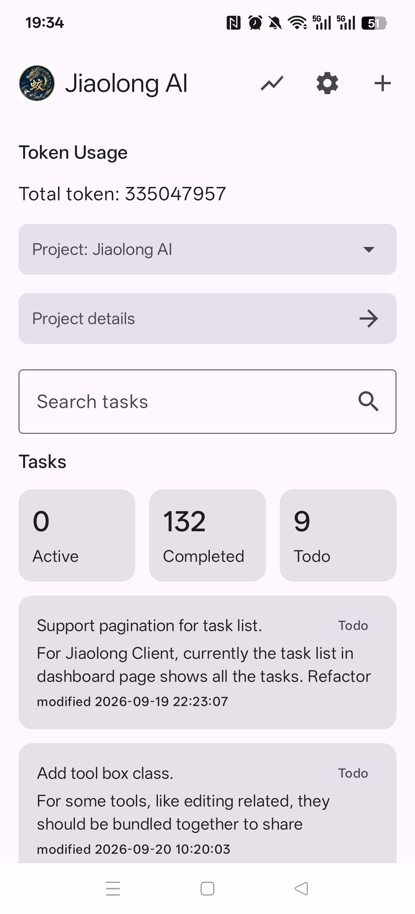
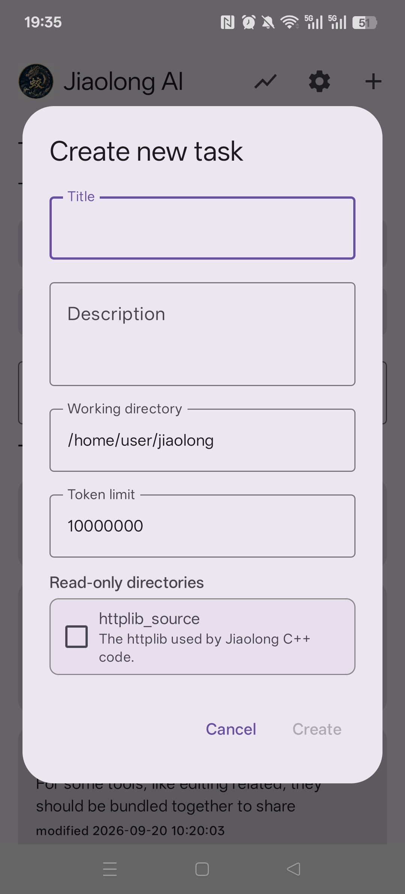
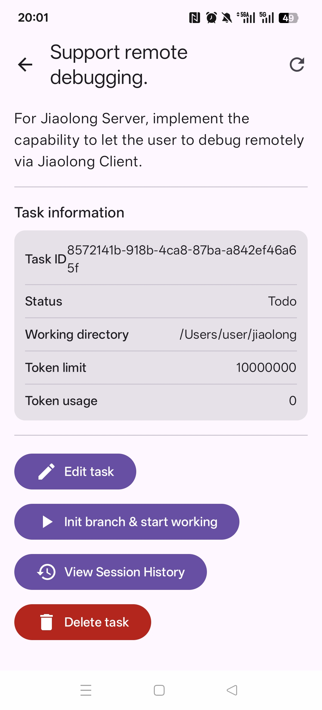
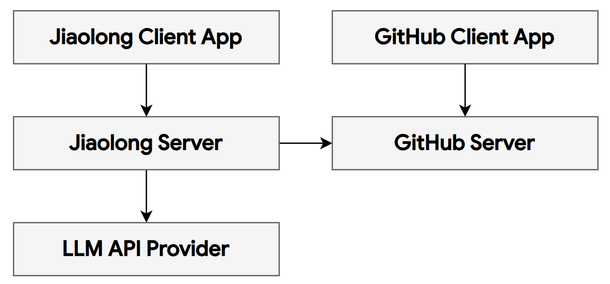

# Jiaolong AI

**Jiaolong** (蛟龙 in Chinese) is a **safe** and **privacy-focused** AI system built for **autopilot long-horizon tasks**. It is designed around the following principles:

- **Sandboxed agent runtime with strict permission control**: Explicitly define what AI agents are allowed to access and do, with security enforced by design. The agent can only touch the specified workspace, without even reading files outside of workspace. The file system operations are conducted within a sandbox with guaranteed security.
- **Privacy-preserving**: Keep your data and interactions under your control. The agent cannot read sensitive information like your crendentials by searching around your file system. It cannot even see the workspace path in the host system.
- **Manage agents, not processes**: Focus on what your AI agents should accomplish, rather than babysitting them through every step.
- **Task-driven execution**: Create a task and let the agent work autonomously until a commit is ready. No need to monitor intermediate results or track its progress.
- **Extremely lightweight**: Build with native C++, the coding agent Jiaolong CLI only consumes less than 10MB memory.
- **Token efficiency**: Each task has an explicit token limit, and can be extended on demand. Jiaolong achieves a high input token cache hit rate of over 95%.

  
  
  

## System Architecture

## License

[LICENSE](LICENSE)
